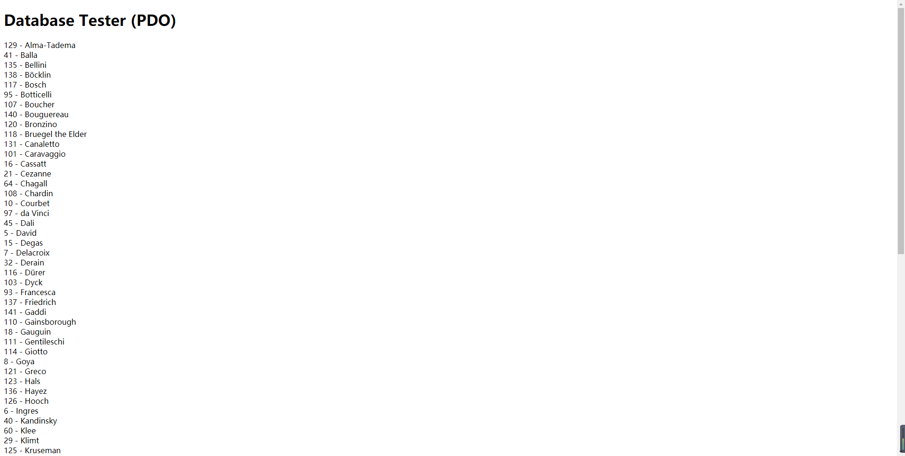
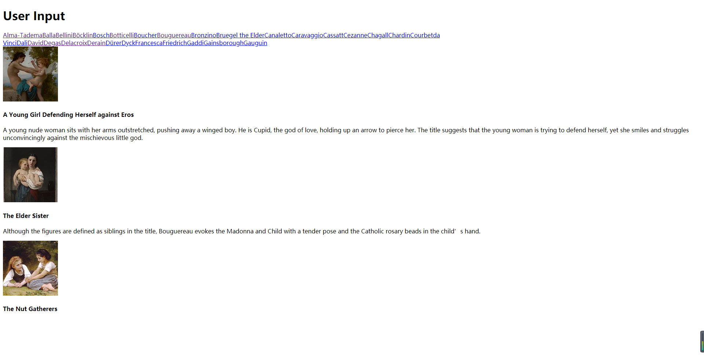
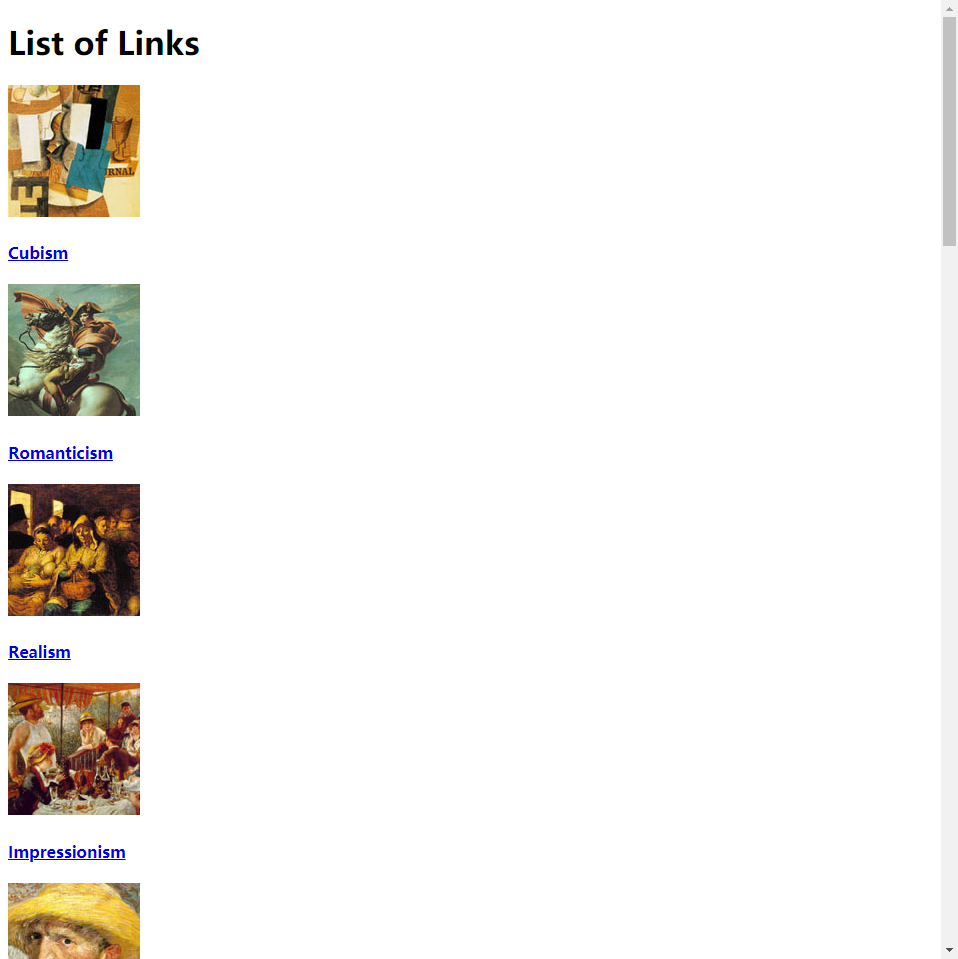

# lab10 文档

# 16307110125 曲俊杰
 
## e7
    
    
1.根据lastname排序，然后显示其artistID-lastname
2.展示genreID

## e8
    
三个函数分别用来展示艺术家/展示画作名称/展示单个images，函数里填充了html代码，达到了动态补充页面的效果

## e9
1.exec()方法
   ```php
   int PDO::exec(string statement)
   ```  
   返回的是受影响的行数
2.query()方法
   ```php
   PDOStatement PDO::query(string statement)
   ```  
   返回对象
3.预处理语句：prepare()语句和execute()语句
   ```php
   PDOStatement PDO::prepare(string statement[,array driver_options])
   bool PDOStatement::execute([array input_parameters])
   ```
   防止mysql注入
   
## e10
构造超链接显示具体页面
    